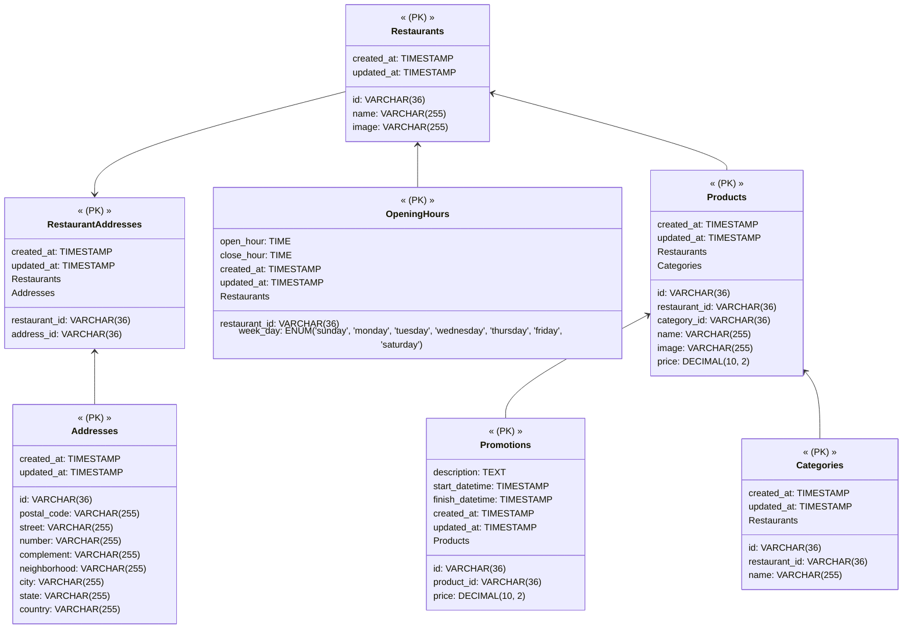

# Goomer Lista Rango! 🍴

API RESTful produzida como **Teste Técnico** disponível [nesse link](https://github.com/goomerdev/job-dev-backend-interview)  para a empresa [Goomer](https://www.goomer.com.br/) capaz de gerenciar restaurantes e produtos do seu cardápio.

### ✅ Funcionalidades

- [x] Listar todos os restaurantes
- [x] Cadastrar novos restaurantes
- [x] Listar os dados de um restaurante
- [x] Alterar os dados um restaurante
- [x] Excluir um restaurante
- [x] Listar todos os produtos de um restaurante
- [x] Listar um produto de um restaurante
- [x] Criar um produto de um restaurante
- [x] Alterar um produto de um restaurante
- [x] Excluir um produto de um restaurante

### 🔧Tecnologias
- [Node.js](https://nodejs.org/en)
- [MySQL](https://www.mysql.com/)
- [Express](https://expressjs.com/pt-br/)
- [ESLint](https://eslint.org/)
- [Prettier](https://prettier.io/)

### ❕❗Observações

- A aplicação infelizmente não está no Docker pois meu notebook é antigo e fraco e não aguenta Docker. 😢
- Não esqueça de preencher o arquivo **.env** com se usuário e senha do MySQL (pode usar como modelo o arquivo **.env.example**).

### 🔁 Rodando a aplicação
```bash
# Clone o repositório
$ git clone https://github.com/mocraveirodev/rango-list.git

# Acesse o diretório
$ cd rango-list

# Instalando dependências
$ yarn

# Instalando dependências
$ yarn

# Iniciando a aplicação em DEV
$ yarn dev

# Iniciando a aplicação em PROD
$ yarn start
```
- Seguindo esses passos, a aplicação estará disponível em: [http://localhost:3333/](http://localhost:3333/)
- Lembre-se de estar com o serviço do [MySQL](https://www.mysql.com/) rodando.
- Utilizando um *Sistema de Gerenciamento de Banco de dados* como o [HeidiSQL](https://www.heidisql.com/), crie uma tabela chamada **"goomer_lista_rango"** e rode o script dsponível no caminho **src\database\database.sql** para criação das tabelas no banco.


### 👩🏻‍💻 Testando manualmente a aplicação
Você pode usar a extensão [REST Client](https://marketplace.visualstudio.com/items?itemName=humao.rest-client) do [VS Code](https://code.visualstudio.com/) para realizar as chamadas à API.
Na pasta **http** há exemplos de todas as funcionalidades da aplicação.

### 🎲Modelagem do Banco de Dados



### 🚀 Desafios

- Não poder usar ORM foi um dos maiores desafios e me ajudou a me desenvolver bastando na criação de queries SQL.
- Tomar decisões de qual arquitetura e modelagem de banco de dados usar também foi desafiador uma vez que nas minhas experiências já recebia isso pronto, porém baseei minha decisões no que eu vi na minha última experiência.
- Não sou muito boa com REGEX e usei para poder me aprimorar.
- Estar focada em Boas Prática.

### 💡 Pontos de melhoria
- Serviço de tradução das mensagem para que a aplicação esteja preparada para escalar pra outros países.
- Busca de endereço pelo CEP, utilizando algum serviço externo.
- Implementação de autenticação, adicionando uma camada de segurança.
- Implementação e TRANSACTIONS nas interações com o DB para garantir consistência em caso de problemas.
- Interfaces e Injeção de Dependências.
- Refatoração.
- Comprimir fotos enviadas para consumo mais rápido;
- Enviar fotos para um bucket online de imagens (ex.: Amazon S3);
- Inserir campo para url de imagem;
- Aplicar testes de integração.

Feito por Monica Craveiro 💜